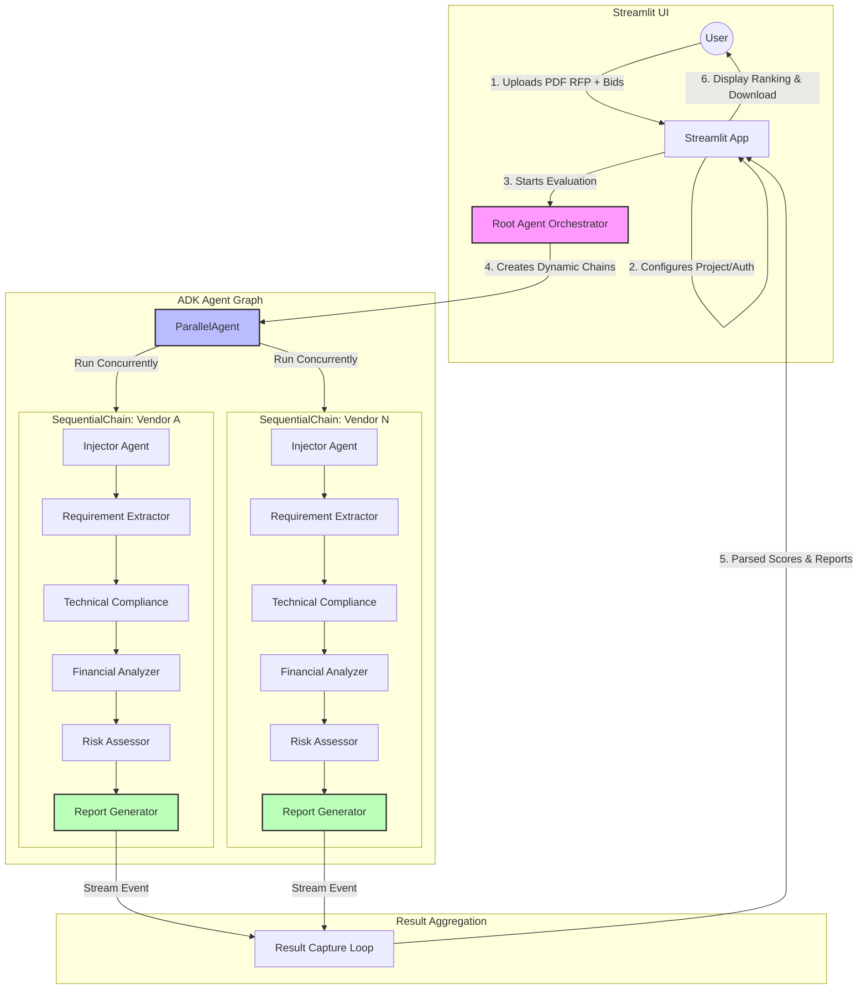

# Autonomous AI-Powered Government Bid Evaluation System

This project is an autonomous bid evaluation system built with the Google Agent Development Kit (ADK) and Gemini 2.5 Flash. It evaluates multiple vendor bids against a single RFP using a multi-agent workflow.

## System Architecture



## Structure

*   `root_agent/`: The orchestrator agent.
*   `requirement_extractor_agent/`: Extracts requirements from RFP.
*   `technical_compliance_agent/`: Checks technical compliance.
*   `financial_analyzer_agent/`: Analyzes financial aspects.
*   `risk_assessor_agent/`: Assesses risks.
*   `report_generator_agent/`: Generates the final scored report.
*   `streamlit_app.py`: The user interface.

## Setup & Authentication

### 1. Configure Environment Variables
The code includes `.env` files. You can set your Project ID there or in the UI.
For Docker, you can pass them as environment variables.

### 2. Authentication
This system uses Vertex AI, so you need Google Cloud credentials.

**Option A: Service Account Key (Recommended for Docker)**
1.  Create a Service Account in Google Cloud Console.
2.  Grant it `Vertex AI User` role.
3.  Download the JSON key.
4.  Upload this JSON key in the Streamlit UI Sidebar.

**Option B: Local gcloud Credentials (ADC)**
1.  Run `gcloud auth application-default login` on your host machine.
2.  Mount the credentials into the container (see below).

## Docker Instructions

### 1. Build the Image
```bash
docker build -t bid-eval-system .
```

### 2. Run Locally
**Simple Run (Use UI to upload Key):**
```bash
docker run -p 8080:8080 bid-eval-system
```
Open [http://localhost:8080](http://localhost:8080). You will need to upload your Service Account JSON key in the sidebar configuration.

**Advanced Run (Mount Local Credentials):**
If you have run `gcloud auth application-default login` on your host (Linux/Mac), you can mount the credentials:
```bash
docker run -p 8080:8080 \
  -v $HOME/.config/gcloud:/root/.config/gcloud \
  bid-eval-system
```

### 3. Using Docker Compose
A `docker-compose.yml` is provided.
```bash
docker-compose up --build
```

## Deployment (Cloud Run)

1.  **Build the container:**
    ```bash
    gcloud builds submit --tag gcr.io/YOUR_PROJECT_ID/bid-eval-system
    ```

2.  **Deploy:**
    ```bash
    gcloud run deploy bid-eval-system --image gcr.io/YOUR_PROJECT_ID/bid-eval-system --platform managed --allow-unauthenticated
    ```

## Local Python Execution (No Docker)

1.  Install dependencies:
    ```bash
    pip install -r requirements.txt
    ```

2.  Run the app:
    ```bash
    streamlit run streamlit_app.py
    ```
